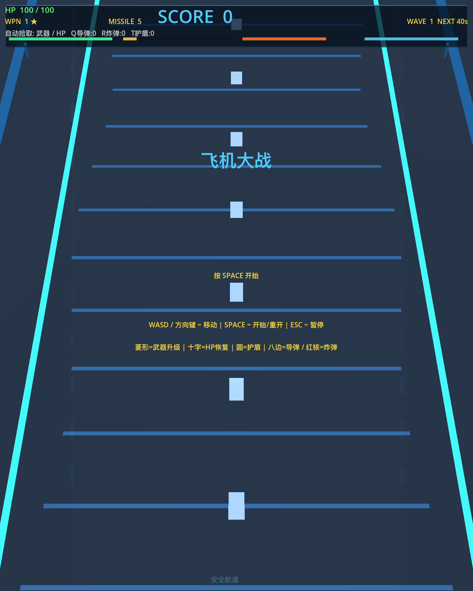
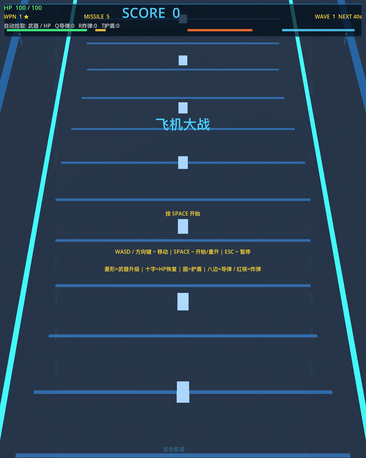

# Godot Plane War

一个使用 **Godot 4** 制作的俯视角飞机大战原型项目，包含 2D HUD + 3D 模型表现、武器升级、导弹/炸弹/护盾道具、连击倍率、波次推进和 Boss 战。

## 项目亮点

- **8 级武器成长**：从单发到大范围高频弹幕
- **3D 模型表现**：玩家、敌机、子弹、导弹、道具和 Boss 均使用 GLB 模型
- **道具系统**：武器升级、回血、护盾、炸弹、导弹
- **连击系统**：连续击杀可提高分数倍率
- **Boss 波次**：每隔数波出现 Boss
- **无缝重开**：开始、暂停、结算和重开逻辑已接入主场景

## 截图 / 预览





## 运行环境

- Godot `4.6.x`（项目配置当前为 `4.2` 特性集，已在本地 `Godot 4.6.2` 下验证可启动）

## 本地运行

```bash
godot --path .
```

如果只想做无头启动检查：

```bash
godot --headless --path . --quit
```

## 操作说明

### 基础操作

- `W / A / S / D`：移动
- `方向键`：移动
- `Space`：开始 / 重新开始
- `Esc`：暂停 / 继续

### 战斗与道具释放

- 自动射击
- `Q`：释放储存导弹
- `R`：释放储存炸弹
- `T`：释放储存护盾

> 说明：`Q / R / T` 当前由 `scripts/main.gd` 中的键盘事件直接处理。

## 项目结构

```text
.
├── docs/
│   └── media/                 # README 中使用的截图与 GIF
├── LICENSE                    # MIT 许可证
├── assets/
│   ├── models/                 # 玩家、敌机、Boss、子弹、导弹、道具 GLB 资源
│   └── baked_models/           # 预烘焙 PackedScene（运行时优先加载）
├── scenes/
│   └── main.tscn               # 主场景（HUD、开始界面、结算界面）
├── scripts/
│   ├── main.gd                 # 核心玩法逻辑
│   ├── build_baked_models.gd   # 生成 baked_models 的 Godot 脚本
│   └── build_glb_assets_blender.py
├── project.godot               # Godot 项目入口
└── README.md
```

## 玩法内容概览

`scripts/main.gd` 当前包含以下主要系统：

- 玩家移动、受击无敌帧、护盾表现
- 多级武器射击逻辑
- 导弹追踪与僚机导弹支援
- 敌机生成、敌弹发射与碰撞判定
- 掉落物生成、拾取、储存与释放
- 连击倍率与分数显示
- 波次计时与 Boss 刷新
- 2D/3D 混合表现与模型同步

## 资源说明

`assets/models/` 中已包含以下模型：

- 玩家：`player_ship.glb`
- 僚机：`wingman_drone.glb`
- 敌机：`enemy_light.glb`, `enemy_mid.glb`, `enemy_heavy.glb`
- Boss：`boss_flagship.glb`
- 子弹/导弹：`player_bullet.glb`, `enemy_bullet.glb`, `homing_missile.glb`
- 道具：`pickup_weapon.glb`, `pickup_heal.glb`, `pickup_shield.glb`, `pickup_bomb.glb`, `pickup_missile.glb`

`assets/baked_models/` 中包含对应的预烘焙 `*.tscn` 版本，运行时会优先尝试加载以降低首次模型解析成本。若需重新生成可执行：

```bash
godot --headless --path . -s scripts/build_baked_models.gd
```

## 后续可继续完善的方向

- 增加导出预设与发布流程
- 拆分 `main.gd` 中的大型玩法逻辑为多个脚本
